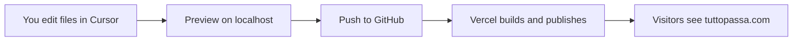

# Tutto Passa — Operations Guide (Beginner Edition)

Everything you need to run, edit, and launch the Tutto Passa website — written for people who are **new to web development**. No jargon without an explanation.

---

## How to use this guide

**Pick your path:**

| I want to… | Start here |
|------------|------------|
| Edit city guides or journal articles on my computer | [First-time setup](#first-time-setup-on-your-computer) → [Editing content](#editing-content) |
| Launch the live website (tuttopassa.com) | [Launch checklist](#launch-checklist) → [Deploy on Vercel](#deploy-on-vercel) → [Newsletter setup](#newsletter) |
| Set up the email newsletter | [Newsletter](#newsletter) |
| Understand a term I keep seeing | [Glossary](#glossary) |

---

## Table of contents

1. [What is this project?](#what-is-this-project)
2. [Glossary](#glossary)
3. [Free software and accounts](#free-software-and-accounts)
4. [First-time setup on your computer](#first-time-setup-on-your-computer)
5. [How this site works](#how-this-site-works)
6. [Launch checklist](#launch-checklist)
7. [Newsletter](#newsletter)
8. [Environment variables explained](#environment-variables-explained)
9. [Deploy on Vercel](#deploy-on-vercel)
10. [Editing content](#editing-content)
11. [Images and media](#images-and-media)
12. [Daily workflow](#daily-workflow)
13. [Site configuration](#site-configuration)
14. [Troubleshooting](#troubleshooting)
15. [What you do NOT need](#what-you-do-not-need)

---

## What is this project?

Tutto Passa is a **website** about Mediterranean slow living — city guides, journal articles, rankings, and a newsletter signup.

Unlike WordPress or Squarespace, there is **no admin panel** and **no CMS** (Content Management System). Instead:

- Articles and city guides are **text files** in folders like `content/destinations/`
- Photos live in `public/images/`
- When you save changes and upload them to GitHub, **Vercel** automatically rebuilds and publishes the live site

You edit files in **Cursor** (or VS Code), preview on your computer, then push to go live.

### What's already built

| Feature | What it is | File location |
|---------|------------|---------------|
| Homepage with video hero | The main landing page | `app/page.tsx`, `components/ui/HomeHero.tsx` |
| Mediterranean Pulse bubble | Rotating weather, quotes, and facts on the hero | `components/mediterranean-pulse/` |
| 8 city guides | Destination pages (Lisbon, Palermo, etc.) | `content/destinations/*.mdx` |
| 6 journal articles | Blog-style stories | `content/stories/*.mdx` |
| Rankings table | Sortable score table for coastal towns | `content/rankings/coastal-towns.json` |
| Newsletter signup | Email form on homepage, footer, `/newsletter` | `components/ui/NewsletterForm.tsx` |
| Privacy policy | Required for newsletter / GDPR | `app/privacy/page.tsx` |
| Social links | Footer links to Instagram, TikTok, etc. | `lib/site-config.ts` |

---

## Glossary

If you see an unfamiliar word later in this guide, look it up here.

| Term | Plain English explanation |
|------|---------------------------|
| **Repository (repo)** | The project folder — all your website files, tracked by Git |
| **Git** | Software that saves snapshots of your files so you can undo mistakes and collaborate |
| **GitHub** | A website that stores your Git repo online (like cloud backup for code) |
| **Commit** | Save a snapshot of your changes locally with a short message ("Add Chania guide") |
| **Push** | Upload your commits from your computer to GitHub |
| **Deploy** | Publish the latest version so visitors on the internet can see it |
| **Vercel** | The service that hosts your live website — it runs the site 24/7 on the internet |
| **MDX** | A text file format: settings at the top + article text below (like a blog post with metadata) |
| **Frontmatter** | The settings block at the top of an MDX file, between two `---` lines |
| **Slug** | The URL-friendly name for a page. File `lisbon.mdx` with slug `lisbon` → `/destinations/lisbon` |
| **YAML** | The format used in frontmatter (indented lines with `key: value`) |
| **JSON** | Another text format for structured data (rankings, pulse quotes) — uses `{` and `[` |
| **Environment variable (env var)** | A secret setting (API key, site URL) stored outside your code — never committed to Git |
| **`.env.local`** | A private file on your computer holding your env vars — already in `.gitignore` so it won't upload |
| **localhost** | Your computer acting as a web server — only you can see it at `http://localhost:3000` |
| **npm** | Node's package manager — downloads the libraries this project needs |
| **Build** | Compiling the site into the version that goes live (catches errors before deploy) |
| **CMS** | An admin panel for editing content (WordPress, Sanity, etc.) — **this site does not use one** |
| **DNS** | Settings at your domain registrar that point `tuttopassa.com` to Vercel's servers |
| **API key** | A secret password that lets your website talk to an external service (like Buttondown) |

---

## Free software and accounts

Everything below has a free tier sufficient for launching Tutto Passa.

| Tool | Free? | What it does | When you need it |
|------|-------|--------------|------------------|
| [Cursor](https://cursor.com) or [VS Code](https://code.visualstudio.com) | Yes | Edit project files | Day one |
| [Node.js](https://nodejs.org) (version 20+) | Yes | Runs the website on your computer | Day one |
| [Git](https://git-scm.com) | Yes | Tracks file changes | Day one |
| [GitHub Desktop](https://desktop.github.com) | Yes | Git with buttons instead of terminal commands | Optional — easier if terminal feels intimidating |
| [GitHub](https://github.com) | Yes | Stores your code online | Before deploy |
| [Vercel](https://vercel.com) | Free tier | Hosts the live website | Before launch |
| [Buttondown](https://buttondown.com) | Free up to 100 subscribers | Stores newsletter emails and sends newsletters | Before launch (recommended) |
| [Squoosh](https://squoosh.app) | Yes | Compresses photos so the site loads fast | When adding images |
| [Photopea](https://www.photopea.com) | Yes | Crop/edit photos in the browser (like Photoshop) | Optional |
| Domain registrar (Namecheap, Cloudflare, etc.) | Paid (~€10–15/year) | Your `.com` address | Before launch |

**You do NOT need:** a CMS, database, map API key, or paid hosting for the MVP. Weather in the Mediterranean Pulse bubble uses [Open-Meteo](https://open-meteo.com) — free, no signup.

---

## First-time setup on your computer

Follow these steps once when you first start working on the project.

### Step 1 — Install Node.js

1. Go to [nodejs.org](https://nodejs.org)
2. Download the **LTS** version (20 or higher)
3. Run the installer (accept defaults)
4. Open a terminal in Cursor: **Terminal → New Terminal**
5. Type `node -v` and press Enter — you should see something like `v20.x.x`

### Step 2 — Open the project in Cursor

1. Open Cursor
2. **File → Open Folder** → select the `tutto-passa` folder
3. You should see folders like `app`, `content`, `public` in the left sidebar

### Step 3 — Install dependencies

In the terminal, run:

```bash
npm install
```

**What this does:** Downloads all the libraries the project needs (Next.js, React, etc.) into a `node_modules` folder. You only need to run this the first time, or after someone else adds new dependencies.

Wait until it finishes (may take 1–2 minutes).

### Step 4 — Start the preview

```bash
npm run dev
```

**What you should see:** A message like `Local: http://localhost:3000`

Open that address in your browser. You are now viewing a **private preview** of the site — only on your computer. Visitors on the internet cannot see this.

### Step 5 — Set up environment variables (optional for now)

Copy the example env file:

**On Mac/Linux:**
```bash
cp .env.example .env.local
```

**On Windows (PowerShell):**
```powershell
Copy-Item .env.example .env.local
```

Open `.env.local` and fill in values when you're ready to test the newsletter (see [Environment variables](#environment-variables-explained)).

### Useful commands

| Command | What it does |
|---------|--------------|
| `npm run dev` | Start local preview at localhost:3000 |
| `npm run build` | Test the production build (catches errors before deploy) |
| `npm run lint` | Check code for common issues |
| `Ctrl+C` in terminal | Stop the dev server |

---

## How this site works



**In plain English:**

1. You edit text files and images on your computer
2. You preview changes at `localhost:3000` before anyone else sees them
3. You **commit** and **push** to GitHub (upload your changes)
4. Vercel detects the push, runs `npm run build`, and updates the live site
5. Within ~1–2 minutes, visitors see your changes at tuttopassa.com

**There is no "Save to website" button.** Saving a file in Cursor only updates your local preview. To go live, you must push to GitHub.

**Content lives in these folders:**

| Content type | Folder |
|--------------|--------|
| City guides | `content/destinations/` |
| Journal articles | `content/stories/` |
| Rankings scores | `content/rankings/` |
| Pulse quotes and facts | `content/pulse/` |
| Photos and videos | `public/images/`, `public/videos/` |

---

## Launch checklist

### Must do before going live

- [ ] **Push repo to GitHub** — Vercel needs your code online to deploy it
- [ ] **Create a Vercel project** from your GitHub repo — this hosts the live site ([details](#deploy-on-vercel))
- [ ] **Set environment variables on Vercel** — `NEXT_PUBLIC_SITE_URL` and `BUTTONDOWN_API_KEY` ([details](#environment-variables-explained))
- [ ] **Create a Buttondown account** and copy your API key — without this, newsletter signups won't work ([details](#newsletter))
- [ ] **Test newsletter signup** on the live site — submit your email, confirm it appears in Buttondown
- [ ] **Connect your domain** in Vercel → point DNS at your registrar — so `tuttopassa.com` works
- [ ] **Run `npm run build` locally** — fix any errors before they break the live deploy
- [ ] **Test on mobile** — homepage, rankings table scroll, Mediterranean Pulse bubble position

### Already done in the repo

These were built during development — you don't need to create them:

- [x] Privacy policy at `/privacy`
- [x] Privacy notice on newsletter forms (links to privacy page)
- [x] Favicon (`app/icon.svg`)
- [x] Default Open Graph image for social sharing (`public/images/og.jpg`)
- [x] Footer social link slots (Instagram, TikTok, Pinterest, YouTube)
- [x] Newsletter shows an error (not fake success) if Buttondown key is missing in production
- [x] SEO sitemap and robots.txt

### Do when you have time

- [ ] **Replace placeholder photos** in `public/images/destinations/` with your own brand photography
- [ ] **Update social URLs** in `lib/site-config.ts` to your real Instagram/TikTok handles
- [ ] **Update contact email** in `lib/site-config.ts`
- [ ] **Add analytics** (Plausible or Google Analytics) — not built yet
- [ ] **Write your first welcome email** in Buttondown

---

## Newsletter

### What newsletter software does

When someone types their email into the signup form on your site, three things need to happen:

1. **Collect** — the form sends the email to your website's backend
2. **Store** — the email is saved in a subscriber list (safely, not in a spreadsheet on your laptop)
3. **Send** — when you write a newsletter, the service emails everyone on the list

Your site handles step 1. A **newsletter service** handles steps 2 and 3.

**Where the form appears on your site:**
- Homepage (newsletter section)
- Footer (every page)
- Dedicated page at `/newsletter`

**What happens technically:** The form sends a POST request to `/api/newsletter`, which is handled by `app/api/newsletter/route.ts`. That file talks to Buttondown's API using your API key.

---

### Free newsletter options — which one to use?

Your site is **already connected to Buttondown**. Other services would require code changes.

| Service | Free tier | Works with this site today? | Best for |
|---------|-----------|----------------------------|----------|
| **[Buttondown](https://buttondown.com)** | 100 subscribers | **Yes — already connected** | Simple editorial newsletters, writers, indie brands |
| [Brevo](https://www.brevo.com) (formerly Sendinblue) | 300 emails/day | No — needs code change | Marketing automation, larger lists |
| [Mailchimp](https://mailchimp.com) | 500 contacts (with limits) | No — needs code change | Email templates, e-commerce |
| [Substack](https://substack.com) | Free to publish | No — it's a separate platform | If you want Substack to be your main home, not your own site |
| [ConvertKit](https://kit.com) (now "Kit") | 10,000 subscribers (limited features) | No — needs code change | Creators, landing pages, funnels |
| Google Forms + Google Sheets | Free | No — manual, no on-site form | Not recommended for a professional launch |

**Recommendation for Tutto Passa: use Buttondown.**

- Zero code changes — it's already wired up
- Free until you have 100 subscribers
- Clean, minimal dashboard — fits the editorial brand
- Write and send newsletters in markdown
- GDPR-friendly options (double opt-in, privacy policy link already on your forms)

**Want a different service later?** It's possible, but someone would need to edit `app/api/newsletter/route.ts` to call a different API and update the environment variable names. That's outside the scope of this beginner guide.

---

### Buttondown setup — step by step

#### 1. Create your account

1. Go to [buttondown.com](https://buttondown.com)
2. Click **Sign up** (free plan is fine)
3. Confirm your email address when Buttondown sends you a confirmation link

#### 2. Get your API key

An API key is like a password that lets your website talk to Buttondown securely.

1. Log in to Buttondown
2. Click **Settings** (gear icon or sidebar)
3. Go to **API**
4. Copy your **API key** — it looks like a long random string

Keep this key private. Never paste it in a public GitHub issue or share it in a screenshot.

#### 3. Add the key locally (for testing on your computer)

1. In Cursor, open `.env.local` in the project root (create it by copying `.env.example` if it doesn't exist)
2. Add or update this line:

```env
BUTTONDOWN_API_KEY=paste_your_key_here
```

3. Save the file
4. **Restart the dev server** — stop it with `Ctrl+C`, then run `npm run dev` again (env vars only load on startup)
5. Go to `http://localhost:3000/newsletter`, enter your email, click Subscribe
6. Log in to Buttondown → **Subscribers** — your email should appear within a few seconds

#### 4. Add the key on Vercel (for the live website)

Local `.env.local` only works on your computer. The live site needs the key in Vercel:

1. Go to [vercel.com](https://vercel.com) → your Tutto Passa project
2. **Settings** → **Environment Variables**
3. Add:
   - Name: `BUTTONDOWN_API_KEY` → Value: your API key → Environments: Production (and Preview if you want)
   - Name: `NEXT_PUBLIC_SITE_URL` → Value: `https://tuttopassa.com` (or your domain)
4. Click **Save**
5. **Redeploy** — go to **Deployments** → click the three dots on the latest deployment → **Redeploy**

Environment variable changes don't apply to already-running deployments until you redeploy.

#### 5. Test on the live site

1. Visit `https://yourdomain.com/newsletter` (or your Vercel preview URL)
2. Submit your email
3. Check Buttondown **Subscribers** again
4. You should see a success message: "Welcome aboard — slow living updates heading your way."

**If you see an error** like "Newsletter is not configured yet" — the API key is missing on Vercel or you forgot to redeploy.

---

### Local testing without Buttondown (optional)

If you haven't set up Buttondown yet but want to test that the form UI works:

1. In `.env.local`, add: `NEWSLETTER_DEV_MODE=true`
2. Restart `npm run dev`
3. Submitting the form will show a success message — but **the email is NOT saved anywhere**

**Never set `NEWSLETTER_DEV_MODE=true` on Vercel.** It's for local development only.

---

### Sending your first newsletter in Buttondown

Once you have subscribers, here's how to email them:

1. Log in to [buttondown.com](https://buttondown.com)
2. Click **Emails** in the sidebar
3. Click **New email** (or **Compose**)
4. Write a **Subject** line (what people see in their inbox)
5. Write the **Body** — Buttondown supports markdown (headings with `##`, links with `[text](url)`, etc.)
6. Click **Send test email to yourself** — always do this first
7. Read the test email. Fix typos.
8. When ready, click **Publish** (or **Send**) — only people on your subscriber list receive it

**Tips for Tutto Passa:**
- Keep the tone unhurried — match the brand voice
- One clear idea per email works better than cramming everything in
- Link back to a destination guide or journal article on your site

**Welcome email / double opt-in (EU-friendly):**
- In Buttondown **Settings**, you can enable **double opt-in** — subscribers must confirm via email before they're added (recommended for EU visitors / GDPR)
- You can also set up an automatic **welcome email** that sends when someone subscribes

---

### Legal note

Your site already includes:
- A privacy policy at `/privacy` explaining how you handle email addresses
- A notice on every newsletter form: "By subscribing you agree to our privacy policy"

Subscribers' emails are stored by **Buttondown** (not in your codebase). Buttondown acts as your data processor for newsletter purposes.

---

## Environment variables explained

Environment variables are **secret settings** stored outside your code. They let you use different values on your computer vs the live site, and keep API keys out of GitHub.

### Your `.env.local` file (local computer only)

Copy `.env.example` to `.env.local` and fill in:

```env
NEXT_PUBLIC_SITE_URL=https://tuttopassa.com
BUTTONDOWN_API_KEY=your_buttondown_api_key_here
```

| Variable | Required on live site? | What it does |
|----------|------------------------|--------------|
| `NEXT_PUBLIC_SITE_URL` | **Yes** | Your real website address. Used for sitemap URLs, Open Graph links when someone shares your site on social media, and canonical links for SEO. Use `https://tuttopassa.com` (no trailing slash). |
| `BUTTONDOWN_API_KEY` | **Yes** | Connects newsletter signups to your Buttondown account. Without it, the live form shows an error. |
| `NEWSLETTER_DEV_MODE` | **Never on Vercel** | Set to `true` in `.env.local` only if you want to test the form UI without Buttondown. Does not save emails. |

> **Important:** `.env.local` is in `.gitignore` — it never gets uploaded to GitHub. That's intentional. Your API key must stay private.

> **Without `BUTTONDOWN_API_KEY` on Vercel:** The newsletter form on the live site will show "Newsletter is not configured yet. Please try again later." This is correct behaviour — it prevents silently losing subscriber emails.

---

## Deploy on Vercel

Vercel hosts your live website. Every time you push to GitHub, Vercel rebuilds and publishes automatically.

### Before you start

- Your code must be on GitHub (pushed from your computer)
- You need a free Vercel account

### Step 1 — Push your code to GitHub

**Using the terminal:**

```bash
git add .
git commit -m "Ready for launch"
git push
```

**Using GitHub Desktop (easier for beginners):**

1. Open GitHub Desktop
2. Select the `tutto-passa` repository
3. You'll see changed files listed on the left
4. Write a short summary at the bottom (e.g. "Ready for launch")
5. Click **Commit to main**
6. Click **Push origin**

### Step 2 — Import the project on Vercel

1. Go to [vercel.com/new](https://vercel.com/new)
2. Sign up or log in — **use "Continue with GitHub"** so Vercel can access your repos
3. Find `tutto-passa` in the list → click **Import**
4. Vercel auto-detects **Next.js** — leave settings as default
5. Before clicking Deploy, expand **Environment Variables** and add:
   - `NEXT_PUBLIC_SITE_URL` = `https://tuttopassa.com`
   - `BUTTONDOWN_API_KEY` = your Buttondown key
6. Click **Deploy**

**What you should see:** A progress log, then "Congratulations!" with a preview URL like `tutto-passa-abc123.vercel.app`. Click it — your site is live on a temporary Vercel address.

### Step 3 — Connect your custom domain

1. In Vercel, open your project → **Settings** → **Domains**
2. Type your domain (e.g. `tuttopassa.com`) → click **Add**
3. Vercel shows **DNS records** you need to add (usually an A record or CNAME)
4. Log in to your domain registrar (where you bought the domain — Namecheap, Cloudflare, Google Domains, etc.)
5. Find **DNS settings** and add the records Vercel showed you
6. Back in Vercel, wait for the domain to show a green checkmark

DNS can take a few minutes to 48 hours to propagate. Often it's under 30 minutes.

### Step 4 — Verify everything works

- [ ] Homepage loads at your domain
- [ ] A destination page loads (e.g. `/destinations/lisbon`)
- [ ] Newsletter signup works and subscriber appears in Buttondown
- [ ] Mobile layout looks good

### Ongoing deploys

Every `git push` to your main branch triggers a new deploy (~1–2 minutes). You don't need to log in to Vercel for routine content updates — just push.

If a deploy fails, check **Vercel → Deployments → click the failed deploy → View Logs** for error messages.

---

## Editing content

### How to open and edit a file in Cursor

1. Look at the **left sidebar** (file explorer)
2. Click the folder to expand it (e.g. `content` → `destinations`)
3. **Double-click** a file (e.g. `lisbon.mdx`) to open it
4. Edit the text
5. **Save** with `Ctrl+S` (Windows) or `Cmd+S` (Mac)
6. If `npm run dev` is running, refresh your browser to see changes

---

### What is a slug?

A **slug** is the short name used in the URL.

| File name | Slug in rankings JSON | Resulting URL |
|-----------|----------------------|---------------|
| `lisbon.mdx` | `"slug": "lisbon"` | `/destinations/lisbon` |
| `italian-espresso-ritual.mdx` | (stories use filename as slug) | `/stories/italian-espresso-ritual` |

**Rule for destinations:** The slug in `coastal-towns.json` must **exactly match** the MDX filename (without `.mdx`). If they don't match, the destination page will 404 (not found).

The site loads destination scores from the rankings file — if a city isn't listed there, the page won't render even if the MDX file exists.

---

### YAML tips for beginners

The settings at the top of MDX files use YAML format. Common mistakes:

- **Use spaces, not tabs** for indentation
- **Keep colons out of list items** — if a tip contains a colon, wrap the whole line in quotes: `"Tip: arrive before 10am"`
- **Quote values with special characters** — e.g. `"€45–65/day"`
- The frontmatter must start and end with `---` on their own lines

If `npm run build` fails after editing MDX, the error message usually points to the line with bad YAML.

---

### Add a new destination (city guide)

**Three steps — the slug must match everywhere.**

#### Step 1 — Create the MDX file

Create `content/destinations/your-city.mdx`

Copy structure from `content/destinations/lisbon.mdx`. Template:

```yaml
---
title: Your City
country: Italy
region: Sicily
tagline: One line that captures why it's special.
heroImage: /images/destinations/your-city.jpg
whyVisit:
  - Reason one
  - Reason two
bestCafes:
  - name: Café Name
    neighbourhood: Neighbourhood
    note: Short description.
bestRestaurants:
  - name: Restaurant Name
    neighbourhood: Neighbourhood
    note: Short description.
beaches:
  - name: Beach Name
    note: Description.
    tags: [family, hidden]
sunsetSpots:
  - name: Spot Name
    neighbourhood: Area
    note: Why it's good at sunset.
walkability: A short paragraph about walking the city.
walkabilityScore: 8
neighbourhoods:
  - Neighbourhood one — description
  - Neighbourhood two — description
costEstimate:
  budget: "€45–65/day"
  mid: "€80–120/day"
  luxury: "€150+/day"
bestSeasons: April–June and September.
localTips:
  - Tip one without colons in the middle of the line
  - Tip two
dayTrips:
  - name: Nearby Place
    note: Why visit.
---

Write two or three paragraphs of editorial overview here in markdown.
Use normal paragraphs — this is the essay part of the guide.
```

#### Step 2 — Add the hero image

1. Save your photo as `public/images/destinations/your-city.jpg`
2. The path in frontmatter is `/images/destinations/your-city.jpg` (starts with `/`, no `public`)

See [Images and media](#images-and-media) for compression tips.

#### Step 3 — Add scores to rankings

Open `content/rankings/coastal-towns.json` and add an entry with the **same slug**:

```json
{
  "slug": "your-city",
  "city": "Your City",
  "country": "Italy",
  "scores": {
    "coffee": 8,
    "food": 9,
    "beaches": 7,
    "weather": 8,
    "walkability": 8,
    "atmosphere": 9,
    "cost": 7,
    "overall": 8
  }
}
```

Scores are out of 10. The `overall` score is typically an average feel — use your editorial judgment.

#### Step 4 — Verify

```bash
npm run dev
```

Visit:
- `http://localhost:3000/destinations/your-city` — the guide page
- `http://localhost:3000/rankings/coastal-towns` — your city in the table

---

### Add a new journal article

Create `content/stories/your-article-slug.mdx`:

```yaml
---
title: Your Article Title
excerpt: One sentence for cards and SEO — keep it under ~160 characters.
heroImage: /images/stories/your-article-slug.jpg
author: Tutto Passa
publishedAt: 2026-07-06
---

Opening paragraph that hooks the reader.

## Section heading

More body content. Use `##` for section headings, normal paragraphs for text.

## Another section

Articles appear automatically on `/stories` (sorted newest first by `publishedAt`) and in the homepage journal section.
```

Save the hero image to `public/images/stories/your-article-slug.jpg`.

The filename (without `.mdx`) becomes the URL slug: `/stories/your-article-slug`.

---

### Edit rankings

**Update scores for existing cities:** Edit `content/rankings/coastal-towns.json` — change the numbers in the `scores` object.

**Create a new ranking list** (e.g. "Best Coffee Cities"):

1. Create `content/rankings/coffee-cities.json` with the same structure as `coastal-towns.json`
2. A new page automatically appears at `/rankings/coffee-cities`

---

### Edit Mediterranean Pulse bubble

The rotating bubble on the homepage hero pulls from these files:

| Content type | File |
|--------------|------|
| Quotes | `content/pulse/quotes.json` |
| Coffee facts | `content/pulse/coffee-facts.json` |
| Local facts | `content/pulse/mediterranean-facts.json` |
| Live weather cities | `lib/mediterranean-pulse/locations.ts` |

For JSON files, add a new object to the array with a unique `"id"` field:

```json
{
  "id": "quote-007",
  "text": "The afternoon belongs to whoever stays.",
  "attribution": "Tutto Passa"
}
```

Don't duplicate `"id"` values — each entry needs a unique one.

Weather data comes from Open-Meteo automatically — no API key needed. If the API is down, the bubble shows editorial content only (quotes, facts) until weather returns.

---

### Edit the philosophy page

Unlike destinations and stories, the philosophy page content is **not** in an MDX file. Edit it directly in:

`app/philosophy/page.tsx`

Save, preview at `/philosophy`, push when happy.

---

## Images and media

### Where files go

| Asset | Save to | Reference in content |
|-------|---------|---------------------|
| Destination photos | `public/images/destinations/` | `/images/destinations/name.jpg` |
| Story photos | `public/images/stories/` | `/images/stories/name.jpg` |
| Homepage hero video | `public/videos/hero.mp4` | Used automatically in `HomeHero.tsx` |
| Social share image | `public/images/og.jpg` | Set in `app/layout.tsx` |
| Design mood board | `references/` | **Not served on site** — design reference only |

**Important:** Paths in MDX start with `/images/...` — do not include `public` in the path.

### Free tools for preparing images

| Tool | What to use it for |
|------|-------------------|
| [Squoosh](https://squoosh.app) | Compress photos — drag in, resize, download smaller JPG. Aim for under 300KB for cards, under 1MB for hero images. |
| [Photopea](https://www.photopea.com) | Crop and adjust photos in the browser (free Photoshop alternative) |
| [GIMP](https://www.gimp.org) | Desktop photo editor (free, more powerful) |

### Image tips for Tutto Passa brand

- Landscape orientation, roughly 3:2 or 4:3 ratio for hero and card images
- Warm, golden-hour, Mediterranean feel — see `references/design-analysis.md`
- Compress before uploading — large files slow down the site
- Hero video is at `public/videos/hero.mp4` (~14MB) — acceptable for launch; optimize later if load time matters

### External images (not recommended)

If you must use a photo hosted on another website (e.g. Unsplash), add the hostname to `next.config.ts` under `remotePatterns`. Using local files in `public/images/` is simpler and faster.

---

## Daily workflow

### Using the terminal

```bash
git pull                    # get latest changes from GitHub
npm run dev                 # start preview (if not already running)
# ... edit files in Cursor, save, refresh browser ...
npm run build               # optional: verify before push
git add .
git commit -m "Add Chania guide updates"
git push                    # triggers Vercel deploy
```

### Using GitHub Desktop

1. Open GitHub Desktop → select `tutto-passa`
2. Click **Fetch origin** then **Pull origin** (get latest changes)
3. Run `npm run dev` in Cursor's terminal for preview
4. Edit files in Cursor, save, refresh browser
5. Back in GitHub Desktop — changed files appear automatically
6. Write a commit message (e.g. "Add Chania guide updates")
7. Click **Commit to main**
8. Click **Push origin** — Vercel deploys within ~2 minutes

**No database migrations, no admin panel, no FTP.** Just files → Git → Vercel.

---

## Site configuration

Edit `lib/site-config.ts` to update brand-wide settings:

```typescript
social: {
  instagram: "https://instagram.com/yourhandle",
  tiktok: "https://tiktok.com/@yourhandle",
  pinterest: "https://pinterest.com/yourhandle",
  youtube: "https://youtube.com/@yourhandle",
},
contactEmail: "hello@tuttopassa.com",
```

Replace placeholder handles with your real social accounts before launch. Footer links pull from this file automatically.

---

## Troubleshooting

| What you see | Likely cause | What to try |
|--------------|--------------|-------------|
| Destination page shows 404 | Slug in MDX filename doesn't match `coastal-towns.json` | Open both files side by side — the slug must be identical |
| Destination page shows 404 | City missing from rankings JSON | Add an entry to `content/rankings/coastal-towns.json` |
| Image broken / won't load | Wrong path in frontmatter | Use `/images/destinations/name.jpg` — check file exists in `public/images/` |
| Image broken (external URL) | Domain not allowed | Use a local file in `public/images/` instead, or add domain to `next.config.ts` |
| "Newsletter is not configured yet" on live site | Missing `BUTTONDOWN_API_KEY` on Vercel | Add key in Vercel → Settings → Environment Variables → Redeploy |
| Newsletter error locally | No key and no dev mode | Add `BUTTONDOWN_API_KEY` to `.env.local`, or `NEWSLETTER_DEV_MODE=true` for UI testing only |
| `npm run build` fails after editing MDX | YAML syntax error in frontmatter | Check indentation (spaces not tabs), quotes around values with colons |
| `npm run dev` fails immediately | Dependencies not installed | Run `npm install` first |
| Changes not on live site | Didn't push, or Vercel deploy failed | Run `git push`, then check Vercel → Deployments for errors |
| Mediterranean Pulse shows no weather | Open-Meteo API temporarily down | Normal — editorial content still rotates; weather returns when API works |
| Domain not working after DNS setup | DNS still propagating | Wait up to 48 hours; check Vercel Domains tab for status |

---

## What you do NOT need

These were intentionally left out of the MVP — don't look for them:

- Interactive map
- User accounts / login
- Itinerary builder
- CMS admin panel
- Search (fine with fewer than ~20 destinations)
- Payment / membership
- Database

When content volume grows, a CMS like Sanity can be added later. For now, editing files in Cursor works well.

---

## Accounts summary

| Service | Purpose | Cost |
|---------|---------|------|
| GitHub | Store code online, trigger deploys | Free |
| Vercel | Host the live website | Free tier |
| Buttondown | Newsletter subscribers + sending | Free to 100 subscribers |
| Domain registrar | Your `.com` address | ~€10–15/year |
| Open-Meteo | Live weather in Mediterranean Pulse | Free, no account needed |

---

*Last updated for Tutto Passa MVP launch. For design tokens and UI principles, see `references/design-analysis.md`.*
